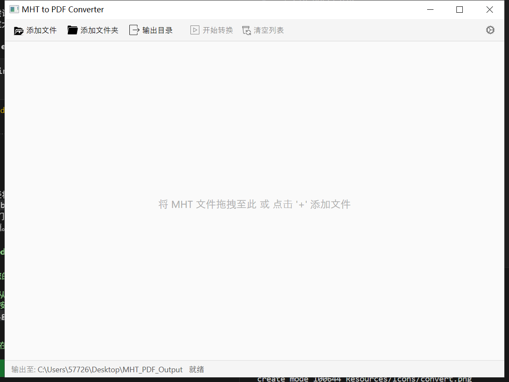

# MHT 到 PDF 转换器 (批量转换工具)

这是一个简单易用的 Windows 桌面工具，可以帮助您将多个 MHT 或 MHTML 文件批量转换为 PDF 文档。转换后的 PDF 文件会尽可能保留原始网页的布局、图片、样式和链接。

## 主要功能

*   **批量转换**: 一次性处理多个 MHT/MHTML 文件。
*   **格式保持**: 利用 Edge 浏览器核心技术 (WebView2) 确保转换效果接近原始网页。
*   **简单操作**: 提供图形界面，支持拖拽添加文件。
*   **自定义输出**: 可以指定 PDF 文件保存的位置和命名规则。
*   **进度与状态**: 清晰显示每个文件的转换状态（待处理、转换中、成功、失败）。
*   **错误提示**: 对转换失败的文件提供错误信息（可在右键菜单查看，暂未完全实现）。

## 如何使用 (推荐给普通用户)

我们为普通用户提供了方便的 **安装包**，无需关心复杂的配置和技术细节，下载安装即可使用！

1.  **下载**: 前往本仓库的 [**Releases**](https://github.com/zaijun91/Slech-Batch-Conversion-Tool/releases) 页面 (请注意，您可能需要先手动创建第一个 Release 并上传安装包)。找到最新版本的 `MhtToPdfConverter_Setup.exe` 文件并下载。
2.  **安装**: 双击运行下载的 `MhtToPdfConverter_Setup.exe` 文件，按照提示完成安装。安装程序会自动检查并提示安装所需的 WebView2 运行时（如果您的系统缺少的话）。
3.  **运行**: 安装完成后，可以从开始菜单或桌面快捷方式（如果创建了）启动 "MHT to PDF Converter"。
4.  **使用**:
    *   点击 "添加文件" 或 "添加文件夹" 按钮，选择您要转换的 MHT/MHTML 文件。您也可以直接将文件或文件夹拖拽到程序窗口的文件列表中。
    *   点击 "输出目录" 按钮，选择转换后的 PDF 文件要保存的位置。
    *   点击 "开始转换" 按钮，程序将开始处理文件列表中的任务。
    *   您可以在列表中看到每个文件的转换状态。

## 技术栈 (面向开发者)

本项目主要使用以下技术构建：

*   **.NET 8**: 最新的微软开发平台。
*   **WPF (Windows Presentation Foundation)**: 用于构建 Windows 桌面应用程序界面的框架。
*   **MVVM (Model-View-ViewModel)**: 一种流行的软件架构模式，用于分离界面逻辑和业务逻辑。
*   **Microsoft Edge WebView2**: 嵌入 Edge 浏览器引擎，用于精确渲染 MHT/MHTML 文件并进行打印到 PDF 的操作。
*   **WindowsAPICodePack**: 用于调用 Windows Shell API，例如实现更友好的文件夹选择对话框。
*   **Inno Setup**: 用于创建 Windows 安装包。

## 从源代码构建 (面向开发者)

1.  克隆本仓库。
2.  使用 Visual Studio 2022 或更高版本打开解决方案 (`.sln`) 文件，或者使用 .NET CLI。
3.  确保已安装 .NET 8 SDK。
4.  构建解决方案 (Debug 或 Release 配置)。

## 打包 (面向开发者)

1.  在 `Release` 配置下发布项目: `dotnet publish MhtToPdfConverter.csproj -c Release -r win-x64 --output bin\Release\net8.0-windows\win-x64\publish\`
2.  从微软官方下载 [WebView2 Evergreen Standalone Installer (x64)](https://developer.microsoft.com/en-us/microsoft-edge/webview2/#download-section)，将其重命名为 `WebView2Runtime.exe` 并放置在 `Packaging/Resources` 目录下。
3.  准备一个应用程序图标文件 `app_icon.ico` 并放置在 `Packaging/Resources` 目录下。
4.  安装 [Inno Setup 6](https://jrsoftware.org/isinfo.php)。
5.  使用 Inno Setup Compiler (ISCC.exe) 编译 `Packaging/MhtToPdfConverter_Setup.iss` 脚本。生成的安装包将位于 `docs/out` 目录。

## 联系方式 (Contact)

如有问题或建议，可以通过以下方式联系作者：

